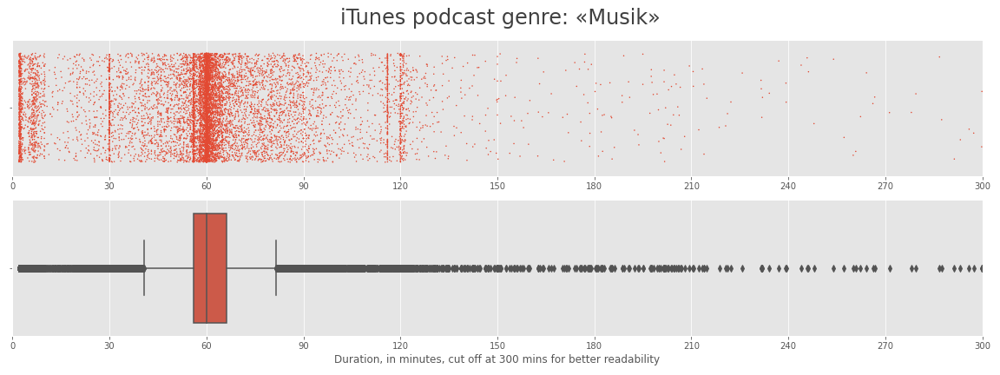
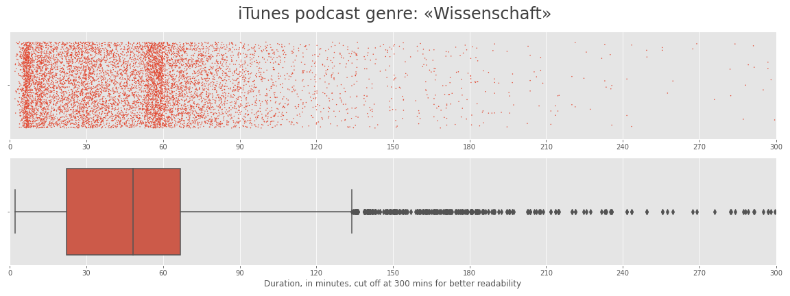
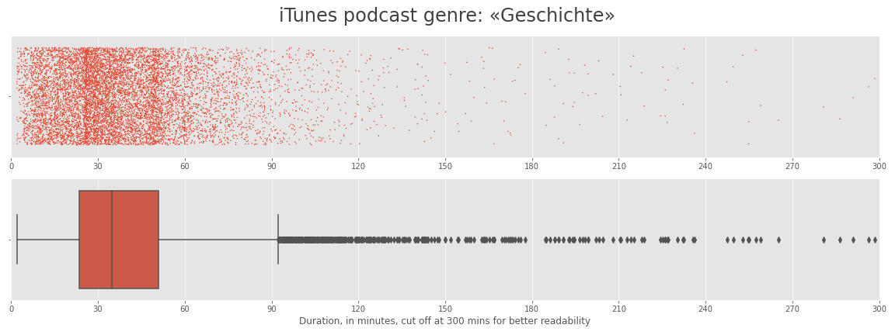
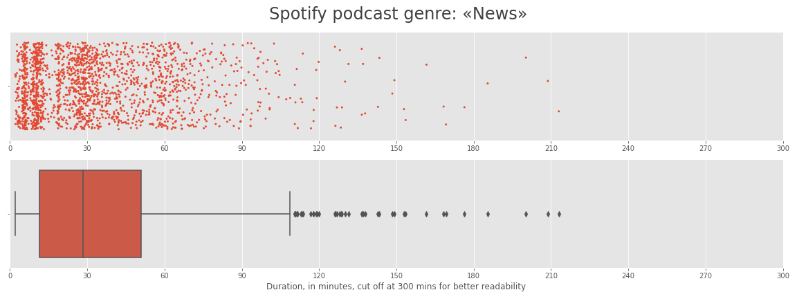
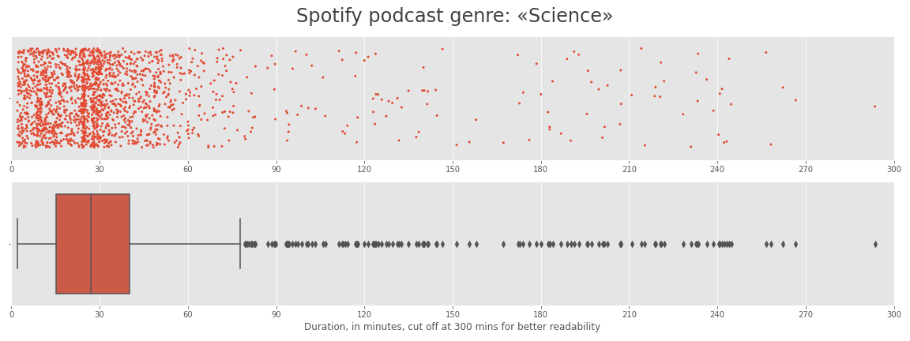

# What is the «ideal» length of a podcast?
**Helping to quantify creative choices for podcast producers by analysing more than 260'000 podcast episodes.**

One interesting aspect of podcasting is that there are very few creative rules, if any. Podcasts are still an emerging medium and best practices are being invented day by day. Every creator is free to find his or her way of content, concept, formatting, etc. 

In this quick analysis, I examine one specific and from my perspective quite crucial aspect of formatting – the lengths of a podcast. I know from professional experience that the «ideal» length of a podcast is discussed intensively and controversely among podcasters. Opinions range from *«It doesn't matter at all as long as the content is interesting and captivating...»* to *«Under no circumstances longer than X minutes for this genre...»*.

I have listened to very short podcasts/episodes of just around a couple of minutes up to very long formats like [«Alles gesagt»](https://www.zeit.de/serie/alles-gesagt) which can potentially last for days. I wonder – how can find creators «their» ideal episode length with good reason? Is it just the time the topic needs? Is the perceived time span more important than the factual duration? Are there actually hard limits to the attention span of users for a given genre?

A first step to clarify this is to look at the numbers. What are «the usual lengths» that successful creators use in general or for particular genres?

For this analysis, I gather meta-data from top podcasts from the two most important podcast platforms: iTunes and Spotify.


# tl;dr
- **I analysed ~225k episodes of ~1.8k iTunes podcasts** and **37k episodes of ~800 Spotify podcasts**.
- **A prototypical length of a podcast episode is around 40 minutes.** 
- **90% of all podcast episodes have a length between 20 and 60 minutes.**
- **Typical lengths vary between the different genres – with median values between 15 and 65 minutes.**


# Results in detail

I removed 

- ~600 episodes without a value for duration
- ~7k episodes shorter than 2 minutes (mostly teasers, trailers, announcements or erroneous values)
- 20 episodes longer than 10 hours (mostly errors though there are some gaming podcast episodes that are actually longer than 10 hours...)


## iTunes

Looking at all iTunes podcasts regardless of genre we get **a typical length of ~39 minutes and a range between 20 and 61 minutes wherein 90% of all episode lengths lie.**

- We have outliers in the data (see plots below), so the mean/average is not a suitable metric here. I only calculate it for completeness sake.
- The median length varies substantially, with a lowest value of ~20 minutes for genre «Bildung» up to ~65 minutes for genre «TV und Film».
- From a practical perspective it makes sense to look at the percentiles. E.g., 90% of all episodes in genre «Gesellschaft und Kultur» have a length between 26 and 61 minutes. If you publish an episode in this percentile range of your genre you are «in good company» (with a length of 42 minutes being prototypical).

```
iTunes podcast lengths – various statistics, values in minutes
Calculated from 1,766 podcasts and 224,946 episodes

iTunes Genre                  median    mean    std    min    max    5%    95%
--------------------------  --------  ------  -----  -----  -----  ----  -----
All episodes                      39      45     12      2    594    20     61

TV und Film                       65      68     19      2    358    34     96
Comedy                            62      64     12      2    486    42     78
Musik                             60      65     15      2    550    57     78
Freizeit                          59      66     15      2    594    31     82
Sport                             52      58     16      2    311    24     83
Technologie                       47      52     13      2    372    26     66
Gesellschaft und Kultur           42      47     11      2    310    26     61
Kunst                             42      47     13      2    437    18     68
Wahre Kriminalfälle               40      44     12      2    285    23     61
Geschichte                        40      43     12      2    368    21     59
Wissenschaft                      39      48     12      2    483    18     62
Religion und Spiritualität        34      35      8      2    445    19     52
Nachrichten                       34      43     10      2    337    18     48
Gesundheit und Fitness            32      34     13      2    209    13     58
Regierung                         30      34     11      2    382    14     46
Kinder und Familie                27      30      9      2    137    13     50
Fiktion                           26      29     11      2    292    11     42
Wirtschaft                        22      28     10      2    242    10     43
Bildung                           20      26      9      2    263    10     43
```


## Spotify

Looking at all Spotify podcasts regardless of genre we get a typical length of **~38 minutes and a range between 23 and 55 minutes wherein 90% of all episodes lie.**

- The median length varies substantially, with a lowest value of ~14 minutes for genre «Religion & Spirituality» up to ~70 minutes for genre «TV und Film».
- Again the percentiles provide meaningful goal posts. As an example: 90% of all episodes in «Comedy» have a length between 44 and 67 minutes. Lengths in this range can be considered prototypical for this genre.

```
Spotify podcast lengths – various statistics, values in minutes
Calculated from 37,229 episodes of 821 podcasts

Spotify Genre              median    mean    std    min    max    5%    95%
-----------------------  --------  ------  -----  -----  -----  ----  -----
All episodes                   38      45     10      2    582    23     55

TV & Film                      70      71     16      2    290    45     94
Sports                         60      62     13      2    192    40     83
Comedy                         55      55      7      2    228    44     67
Society & Culture              53      60      9      2    520    38     64
True Crime                     46      50     11      2    247    31     62
Music                          44      51      9      2    222    32     60
Top Charts                     43      46      9      2    520    27     58
History                        42      45     10      2    346    28     56
Technology                     39      44     11      2    253    20     60
Leisure                        38      48     11      2    402    28     59
Arts                           33      58     11      2    582    21     53
Business                       30      37     10      2    273    19     54
Health & Fitness               29      34     10      2    186    16     49
News                           29      34      5      2    213    23     36
Science                        28      33      7      2    293    17     35
Fiction                        26      33     10      2    242    14     45
Education                      19      25      5      2    165    11     31
Religion & Spirituality        14      23      6      2    302     6     27
```

## Plots of distributions

Below you'll see a small selection of distribution plots. You can look up the full collection in the [`_plots`](https://github.com/rnckp/Data-Science-Projects/tree/main/Podcast%20Lengths%20Analysis/_plots) folder. 

From plotting the lengths for each podcast genre we can observe:

- The data is not normally distributed.
- There are a lot of outliers (mostly unusually long episodes but outliers on the «short» side too). Since we look at the median and the percentiles these do not confound our statistics.
- Some genres have clear length patterns, e.g., iTunes' «Musik» with clear clusters at 30, 60, 120 minutes. Or «Wissenschaft» with two distinct clusters around 10 and 60 minutes. Some of these are likely radio broadcasts that are published as podcasts too.






